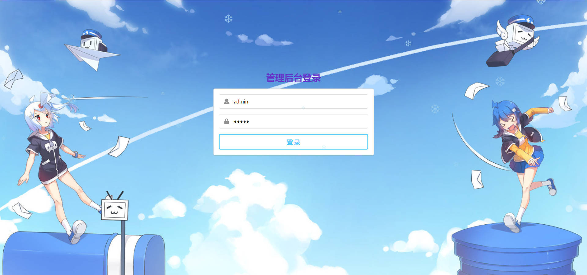
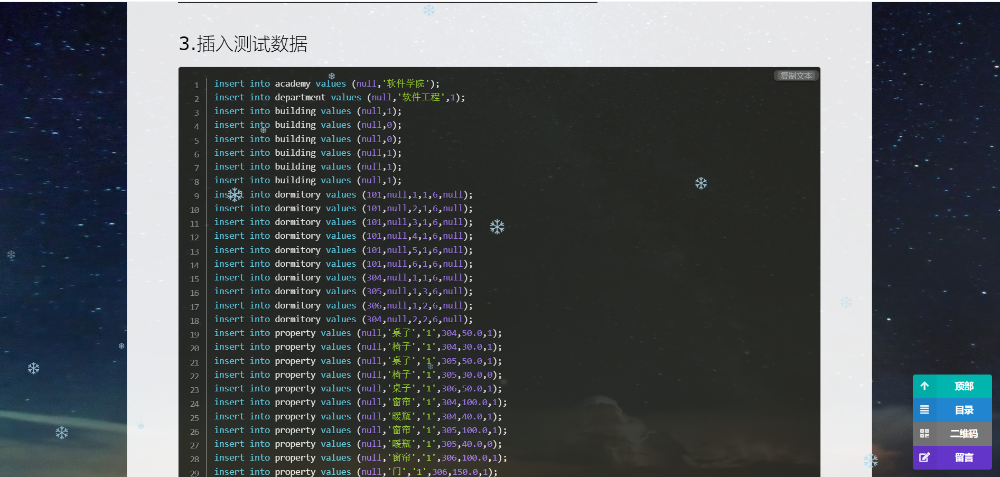

manster博客

#### 介绍

基于SpringBoot+Thymeleaf开发的一个个人博客项目，前端使用 Semantic UI，持久层使用MyBatis，使用Mybatis-Plus方便分页

#### 软件架构

jdk 1.8

后端 ssm + springboot + [mybatis-plus](https://baomidou.com/)

前端 [Thymeleaf](https://www.thymeleaf.org/) + [SemanticUI](https://semantic-ui.com/)

数据库 mysql8

#### 安装教程

1. 下载该项目并解压
2. 使用 idea 打开该项目并使用 maven 下载相关 jar
3. 前后台分为两个项目需要分别进行启动
4. 前台在 localhost:8888，后台在 localhost:9000
5. 管理员账号：admin，管理员密码：admin

####  项目示例

1、管理员登录

2、管理员欢迎页

3、博客管理页

4、博客编辑页

5、博客分类管理页

6、博客分类编辑页

7、博客首页

8、博客详情页

博客头部

博客目录

博客地址(需要修改服务器地址才可扫码查看)

博客代码(可一键复制)

博客赞赏

博客评论展示

博客评论

9、博客分类页

10、博客归档页

11、博客介绍页

