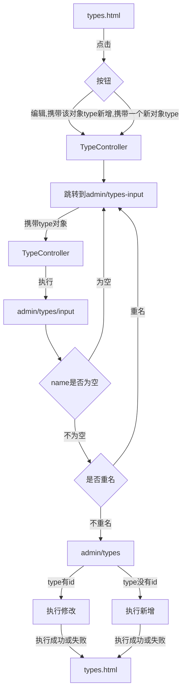

# 1、配置环境

## 1.导入 `mybatis-plus`

```xml
<dependency>
    <groupId>com.baomidou</groupId>
    <artifactId>mybatis-plus-boot-starter</artifactId>
    <version>3.4.1</version>
</dependency>
```

## 2.配置 Mybatis-Plus

```java
package com.manster.config;

import com.baomidou.mybatisplus.annotation.DbType;
import com.baomidou.mybatisplus.extension.plugins.MybatisPlusInterceptor;
import com.baomidou.mybatisplus.extension.plugins.inner.PaginationInnerInterceptor;
import org.springframework.context.annotation.Bean;
import org.springframework.context.annotation.Configuration;

/**
 * @Author manster
 * @Date 2021/4/24
 **/
@Configuration
public class MyBatisPlusConfig {
    @Bean
    public MybatisPlusInterceptor mybatisPlusInterceptor() {
        MybatisPlusInterceptor interceptor = new MybatisPlusInterceptor();
        interceptor.addInnerInterceptor(new PaginationInnerInterceptor(DbType.MYSQL));
        return interceptor;
    }
}
```

## 3.所有 mapper 继承 BaseMapper

```java
@Repository
public interface TypeMapper extends BaseMapper<Type> {
}
```

## 4.实体类

添加对应表名，实现序列化，并表名id按照数据库自增

```java
@TableName("t_user")
public class User implements Serializable {

    @TableId(type= IdType.AUTO)
    private Long id;
    
    private static final long serialVersionUID = 1L;
}
```

# 2、增删改查

[Mybatis-Plus使用教程](https://mp.baomidou.com/guide/)

# 3、分页

## 1.TypeService接口

```java
    /**
     * 得到所有分类
     * @return
     */
    IPage<Type> listType(Page<Type> page);
```

## 2.TypeServiceImpl实现类

```java
    @Override
    public IPage<Type> listType(Page<Type> page) {
        return typeMapper.selectPage(page, null);
    }
```

## 3.TypeController

```java
    @Value("#{project.pageSize}")
    private String pageSize;
    @Autowired
    private TypeService typeService;

    @GetMapping("/types")
    public String types(@RequestParam(defaultValue = "1", name = "current") Integer current,
                        Model model){
        //获取分页信息
        IPage<Type> page = typeService.listType(new Page<>(current, Long.parseLong(pageSize)));
        model.addAttribute("page", page);
        return "admin/types";
    }
```

## 4.page的结果

```json
{
    "records": [
        {
            "id": 1,
            "name": "错误日志"
        },
        {
            "id": 2,
            "name": "学习日志"
        },
        {
            "id": 3,
            "name": "个人总结"
        },
        {
            "id": 4,
            "name": "生活随笔"
        },
        {
            "id": 5,
            "name": "开发日志"
        }
    ],
    "total": 5,
    "size": 5,
    "current": 1,
    "orders": [],
    "optimizeCountSql": true,
    "hitCount": false,
    "countId": null,
    "maxLimit": null,
    "searchCount": true,
    "pages": 1
}
```

## 5.admin/types页面

```html
<table class="ui selectable teal celled table">
    <thead>
        <tr>
            <th class="center aligned">序号</th>
            <th class="center aligned">名称</th>
            <th>操作</th>
        </tr>
    </thead>
    <tbody>
        <tr th:each="type,iterStat : ${page.records}">
            <td th:text="${iterStat.count}" class="center aligned">1</td>
            <td th:text="${type.name}" class="center aligned">java反射</td>
            <td>
                <a href="#" th:href="@{/admin/types/{id}/input(id=${type.id})}" class="ui mini blue button">
                    <i class="ui edit icon"></i>
                    编辑
                </a>
                <a href="#" th:href="@{/admin/types/{id}/delete(id=${type.id})}" class="ui mini red button">
                    <i class="ui trash alternate icon"></i>
                    删除
                </a>
            </td>
        </tr>
    </tbody>
    <tfoot>
        <tr>
          <th colspan="6">
            <div class="ui small pagination menu" th:if="${page.pages} gt 1">
              <a th:href="@{/admin/types(current=${page.current}-1)}" class="icon item" th:unless="${page.current le 1}">
                <i class="left chevron icon"></i>上一页
              </a>
              <th:block th:each="num : ${#numbers.sequence(1,page.pages)}">
                <a th:href="@{/admin/types(current=${num})}" class="item" th:text="${num}">1</a>
              </th:block>
              <a th:href="@{/admin/types(current=${page.current}+1)}" class="icon item" th:unless="${page.current ge page.pages}">
                下一页<i class="right chevron icon"></i>
              </a>
            </div>
            <a href="#" th:href="@{/admin/type/input}" class="ui small right floated teal button">
              <i class="ui plus icon"></i>
              新增
            </a>
          </th>
        </tr>
    </tfoot>
</table>
```

# 4、新增与编辑




TypeController

```java
/**
     * 跳转到分类输入页
     * @return
     */
@GetMapping("/types/input")
public String input(Model model){
    model.addAttribute("type", new Type());
    return "admin/types-input";
}

/**
     * 携带该分类跳转到编辑页面
     * @param id
     * @param model
     * @return
     */
@GetMapping("/types/{id}/input")
public String editType(@PathVariable Long id, Model model) {
    model.addAttribute("type", typeService.getType(id));
    return "admin/types-input";
}

/**
     * 保存分类
     * 如果没有id则为新增，id存在则为修改
     * @param type
     * @return
     */
@PostMapping("/types")
public String saveType(Type type, BindingResult result, RedirectAttributes attributes){
    Type t = typeService.getTypeByName(type.getName());
    if(t != null){
        result.rejectValue("name", "nameError", "该分类已存在，不可重复添加！");
        return "admin/types-input";
    }
    if(!StringUtils.hasText(type.getName())) {
        result.rejectValue("name", "nameError", "请输入分类名称！");
        return "admin/types-input";
    }
    int i;
    if(type.getId() != null){//有id则为修改
        i = typeService.updateType(type);
        if(i < 1){
            attributes.addFlashAttribute("message","修改失败");
        } else {
            attributes.addFlashAttribute("message","修改成功");
        }
    } else {//没有id则为新增
        i = typeService.saveType(type);
        if(i < 1){
            attributes.addFlashAttribute("message","新增失败");
        } else {
            attributes.addFlashAttribute("message","新增成功");
        }
    }

    return "redirect:/admin/types";
}
```

types-input.html

```html
<form action="#" method="post" th:action="@{/admin/types}" th:object="${type}" class="ui form">
    <input type="hidden" name="id" th:value="*{id}">
    <div class="field">
        <div class="ui left labeled input">
            <label class="ui teal basic label">名称</label>
            <input type="text" name="name" placeholder="分类名称" th:value="*{name}" >
        </div>
    </div>

    <div class="ui error message"></div>
    <!--/*/
<div class="ui negative message" th:if="${#fields.hasErrors('name')}">
<i class="close icon"></i>
<div class="header">提交失败：</div>
<p th:errors="*{name}">分类名不可重复！</p>
</div>
/*/-->
    <div class="ui right aligned container">
        <button type="button" class="ui button" onclick="window.history.go(-1)" >返回</button>
        <button class="ui teal submit button">提交</button>
    </div>

</form>

<script>
    $('.ui.form').form({
      fields : {
        title : {
          identifier: 'name',
          rules: [{
            type : 'empty',
            prompt: '请输入标签名称！'
          }]
        }
      }
    });
</script>
```

tag页面与这个类似，只是换了一个对象