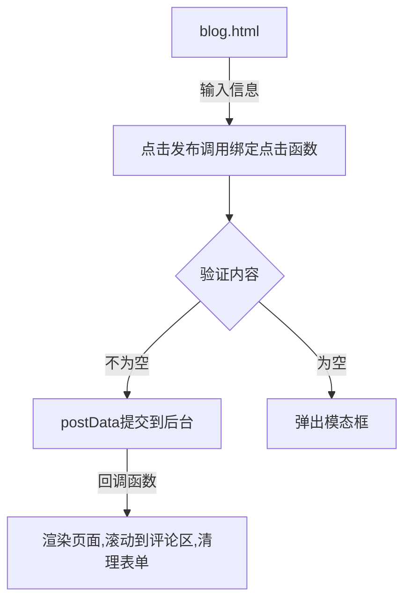
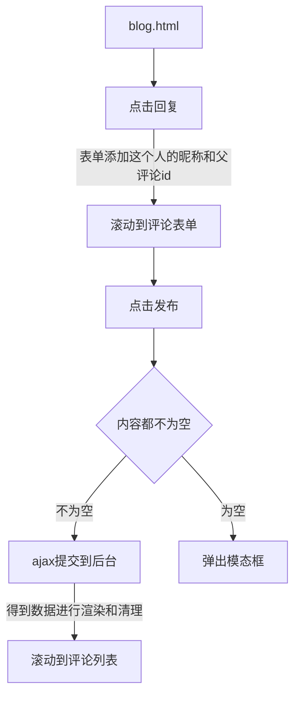

# 1、MarkDonw 转 Html

美化一下背景(使背景固定铺满整个页面)

```css
body {
   background: url("../images/ocean.jpg") !important;
   background-attachment: fixed !important;
   background-size: 100% 100%;
   background-repeat: no-repeat;
   height: 100%;
   width: 100%;
}
```

这里最重要的就是将 `markdown` 的文本变为 `html` 的页面显示在前端

## 1、后端转换

1.首先我们需要引入一个第三方库来帮助我们

```xml
        <!--将markdown格式转成html格式-->
        <dependency>
            <groupId>com.atlassian.commonmark</groupId>
            <artifactId>commonmark</artifactId>
            <version>0.13.1</version>
        </dependency>

        <dependency>
            <groupId>com.atlassian.commonmark</groupId>
            <artifactId>commonmark-ext-heading-anchor</artifactId>
            <version>0.13.1</version>
        </dependency>
        <dependency>
            <groupId>com.atlassian.commonmark</groupId>
            <artifactId>commonmark-ext-gfm-tables</artifactId>
            <version>0.13.1</version>
        </dependency>
```

2.然后我们定制一个自己需要的工具类

```java
package com.manster.util;

import org.commonmark.Extension;
import org.commonmark.ext.gfm.tables.TableBlock;
import org.commonmark.ext.gfm.tables.TablesExtension;
import org.commonmark.ext.heading.anchor.HeadingAnchorExtension;
import org.commonmark.node.Link;
import org.commonmark.node.Node;
import org.commonmark.parser.Parser;
import org.commonmark.renderer.html.AttributeProvider;
import org.commonmark.renderer.html.AttributeProviderContext;
import org.commonmark.renderer.html.AttributeProviderFactory;
import org.commonmark.renderer.html.HtmlRenderer;

import java.util.*;
/**
 * 将markdown文本转为html页面
 * @Author manster
 * @Date 2021/5/2
 **/
public class MarkDownToHtmlUtils {

    /**
     * markdown格式转换成HTML格式
     * @param markdown markdown文本
     * @return 渲染
     */
    public static String markdownToHtml(String markdown) {
        Parser parser = Parser.builder().build();
        Node document = parser.parse(markdown);
        HtmlRenderer renderer = HtmlRenderer.builder().build();
        return renderer.render(document);
    }

    /**
     * 增加扩展[标题锚点，表格生成]
     * Markdown转换成HTML
     * @param markdown markdown文本
     * @return 渲染
     */
    public static String markdownToHtmlExtensions(String markdown) {
        //h标题生成id
        Set<Extension> headingAnchorExtensions = Collections.singleton(HeadingAnchorExtension.create());
        //转换table的HTML
        List<Extension> tableExtension = Arrays.asList(TablesExtension.create());
        Parser parser = Parser.builder()
                .extensions(tableExtension)
                .build();
        Node document = parser.parse(markdown);
        HtmlRenderer renderer = HtmlRenderer.builder()
                .extensions(headingAnchorExtensions)
                .extensions(tableExtension)
                .attributeProviderFactory(new AttributeProviderFactory() {
                    public AttributeProvider create(AttributeProviderContext context) {
                        return new CustomAttributeProvider();
                    }
                })
                .build();
        return renderer.render(document);
    }

    /**
     * 处理标签的属性
     */
    static class CustomAttributeProvider implements AttributeProvider {
        @Override
        public void setAttributes(Node node, String tagName, Map<String, String> attributes) {
            //改变a标签的target属性为_blank
            if (node instanceof Link) {
                attributes.put("target", "_blank");
            }
            if (node instanceof TableBlock) {
                attributes.put("class", "ui celled table");
            }
        }
    }
}
```

3.使用工具类将我们查出的 `blog` 的 `content` 转为 `html` 元素

```java
    @Override
    public BlogVO getBlog(Long id) {
        BlogVO blogVO = blogMapper.getBlogVO(id);
        blogVO.setContent(MarkDownToHtmlUtils.markdownToHtmlExtensions(blogVO.getContent()));
        return blogVO;
    }
```

## 2、前端渲染

用th:text不会解析html，用th:utext会解析html，在页面中显示相应的样式

```html
<div id="content" class="typo typo-selection js-toc-content m-padded-lr-responsive m-padded-tb-large" th:utext="${blog.content}">
```

此时我们的就已经将从数据库中查出的博客转为 html 显示在页面上了

此外，之前的插件 prism 中的复制、行号显示是根据在 `pre` 标签中的属性来进行执行的，所以我们还需要在页面加载时将其属性值添加上去

```js
			//设置代码块显示行号并修改复制文本
			$('pre').attr({
				"class" : "line-numbers",
				"data-prismjs-copy" : "复制文本",
				"data-prismjs-copy-success" : "复制成功"
			});
```

# 2、评论功能

## 1、评论提交与回复

主要是为了得到评论信息，和提交信息

### 1.前端逻辑

1.评论流程图



2.评论代码

这里回调渲染时是利用 `thymeleaf` 的 `th:fragment="commentList"` 

```html
<div id="comment-form" class="ui form">
    <input type="hidden" name="blogId" th:value="${blog.id}" />
    <input type="hidden" name="parentCommentId" value="-1" />
    <div class="field">
        <textarea name="content" placeholder="请输入评论信息..."></textarea>
    </div>
    <div class="fields">
        <div class="field m-mobile-wide m-margin-bottom-small">
            <div class="ui left icon input">
                <i class="user icon"></i>
                <input type="text" name="nickname" placeholder="姓名">
            </div>
        </div>
        <div class="field m-mobile-wide m-margin-bottom-small">
            <div class="ui left icon input">
                <i class="mail icon"></i>
                <input type="text" name="email" placeholder="邮箱">
            </div>
        </div>
        <div class="field m-margin-bottom-small m-mobile-wide">
            <button id="comment-btn" type="button" class="ui violet button m-mobile-wide "><i class="edit icon"></i>发布</button>
        </div>
    </div>
</div>
```

```js
			//form验证
			$('.ui.form').form({
				fields: {
					content: {
						identifier: 'content',
						rules: [{
							type: 'empty',
							prompt: '请输入你的评论'
						}]
					},
					nickname: {
						identifier: 'nickname',
						rules: [{
							type: 'empty',
							prompt: '请输入你的昵称'
						}]
					},
					email: {
						identifier: 'email',
						rules: [{
							type: 'empty',
							prompt: '请填写正确的邮箱地址'
						}]
					}
				}
			});

			//得到评论列表
			$(function () {
                //这里的${blog.id}来自于点击查看博客后BlogController中传来的值
				$("#comment-container").load(/*[[@{/comments/{id}(id=${blog.id})}]]*/"comments/6");
			});

			//发送评论请求
			$('#comment-btn').click(function () {
				let boo = $('.ui.form').form('validate form');
				if(boo){
					postData();
					console.log('校验成功');
				} else {
					$('.ui.basic.modal').modal('show');
				}
			});
			//评论提交到后端
			function postData() {
				$("#comment-container").load(/*[[@{/comments}]]*/"",{
					"parentCommentId" : $("[name='parentCommentId']").val(),
					"blogId" : $("[name='blogId']").val(),
					"nickname" : $("[name='email']").val(),
					"content" : $("[name='content']").val()
				},function (responseTxt, statusTxt, xhr) {
					//清理
					clearContent();

				});
			}
			//提交成功后清理评论区内容
			function clearContent() {
				$("[name='content']").val('');
				$("[name='parentCommentId']").val(-1);
				$("[name='content']").attr("placeholder", "请输入评论信息...");
			}
```

3.回复流程图



4.回复代码

```html
<div id="comment-container" class="ui teal segment">
    <div th:fragment="commentList">
        <div class="ui threaded comments" style="max-width: 100%">
            <h3 class="ui dividing header">评论</h3>
            <div class="comment">
                <a class="avatar">
                    
                </a>
                <div class="content">
                    <a class="author">Matt</a>
                    <div class="metadata">
                        <span class="date">Today at 5:42PM</span>
                    </div>
                    <div class="text">
                        How artistic!
                    </div>
                    <div class="actions">
                        <a class="reply" data-commentid="1" data-commentnickname="Matt" onclick="reply(this)">回复</a>
                    </div>
                </div>
            </div>
        </div>
    </div>
</div>
```

```js
			//回复
			function reply(obj) {
				let commentId = $(obj).data('commentid');
				let commentNickname = $(obj).data('commentnickname');
				//添加信息到评论表单
				$("[name='content']").attr("placeholder", "@" + commentNickname).focus();
				$("[name='parentCommentId']").val(commentId);
				//滚动到评论表单
				$(window).scrollTo($('#comment-form'),500);
			}
```

### 2.后端逻辑

- 首先，当页面加载时将该篇博客的 id 用ajax传到后台，用来查询出关于该篇博客的所有评论
- 然后，前端局部渲染 `th:fragment="commentList"`
- 当评论时
  - 会给予该评论一个隐藏域 `parentCommentId` 父评论id
  - 然后提交到后台，重定向到查询列表页面
  - 再次查询出评论列表渲染页面
- 当回复时，我们点击回复会将该条评论的id作为 新评论的 `parentCommentId` 父评论id
  - 后续步骤与评论一样了

controller

```java
package com.manster.controller;

import com.manster.pojo.Comment;
import com.manster.service.CommentService;
import org.springframework.beans.factory.annotation.Autowired;
import org.springframework.beans.factory.annotation.Value;
import org.springframework.stereotype.Controller;
import org.springframework.ui.Model;
import org.springframework.web.bind.annotation.GetMapping;
import org.springframework.web.bind.annotation.PathVariable;
import org.springframework.web.bind.annotation.PostMapping;

/**
 * @Author manster
 * @Date 2021/5/3
 **/
@Controller
public class CommentController {

    @Autowired
    private CommentService commentService;

    @Value("${project.avatar}")
    private String avatar;

    /**
     * 得到列表
     * @param blogId 评论所属博客id
     * @param model 评论数据
     * @return 返回渲染fragment
     */
    @GetMapping("/comments/{blogId}")
    public String comments(@PathVariable Long blogId, Model model){
        model.addAttribute("comments", commentService.listCommentByBlogId(blogId));
        return "blog :: commentList";
    }

    @PostMapping("/comments")
    public String post(Comment comment){
        commentService.saveComment(comment, avatar);
        return "redirect:/comments/" + comment.getBlogId();
    }

}

```

service

```java
@Autowired
private CommentMapper commentMapper;

@Override
public List<Comment> listCommentByBlogId(Long blogId) {
    List<Comment> comments = commentMapper.selectList(new QueryWrapper<Comment>().eq("blog_id", blogId).orderByAsc("create_time"));
    return CommentReplyUtils.commentReply(comments);
}

@Override
public int saveComment(Comment comment, String avatar) {
    comment.setCreateTime(LocalDateTime.now());
    comment.setAvatar(avatar);
    return commentMapper.insert(comment);
}
```

## 2、评论信息列表展示

主要是为了将评论更加有条理的展示出来，类似这样


主要麻烦在了找出父子两层的关系，我就用最粗暴的方式，以最简单的思维先做出来

```java
package com.manster.service.impl;

import com.baomidou.mybatisplus.core.conditions.query.QueryWrapper;
import com.manster.mapper.CommentMapper;
import com.manster.pojo.Comment;
import com.manster.service.CommentService;
import org.springframework.beans.factory.annotation.Autowired;
import org.springframework.stereotype.Service;

import java.time.LocalDateTime;
import java.util.ArrayList;
import java.util.List;

/**
 * @Author manster
 * @Date 2021/5/3
 **/
@Service
public class CommentServiceImpl implements CommentService {

    @Autowired
    private CommentMapper commentMapper;

    @Override
    public List<Comment> listCommentByBlogId(Long blogId) {
        List<Comment> comments = commentMapper.selectList(new QueryWrapper<Comment>().eq("blog_id", blogId).orderByAsc("create_time"));
        return firstComment(comments);
    }

    @Override
    public int saveComment(Comment comment, String avatar) {
        comment.setCreateTime(LocalDateTime.now());
        comment.setAvatar(avatar);
        return commentMapper.insert(comment);
    }

    public List<Comment> firstComment(List<Comment> comments){
        //存储父评论为根评论-1的评论
        ArrayList<Comment> list = new ArrayList<>();
        for (Comment comment : comments) {
            //其父id小于0则为第一级别的评论
            if(comment.getParentCommentId() < 0){
                //我们将该评论下的所有评论都查出来
                comment.setReplyComments(findReply(comments,comment.getId()));
                //这就是我们最终数组中的Comment
                list.add(comment);
            }
        }
        return list;
    }

    /**
     * @param comments 我们所有的该博客下的评论
     * @param targetId 我们要查到的目标父id
     * @return 返回该评论下的所有评论
     */
    public List<Comment> findReply(List<Comment> comments, Long targetId){
        //第一级别评论的子评论集合
        ArrayList<Comment> reply = new ArrayList<>();
        for (Comment comment : comments) {
            //发现该评论的父id为targetId就将这个评论加入子评论集合
            if(find(comment.getParentCommentId(),targetId)){
                reply.add(comment);
            }
        }
        return reply;
    }

    public boolean find(Long id, Long target){
        //不将第一节评论本身加入自身的子评论集合
        if(id < 0){
            return false;
        }
        //如果父id等于target，那么该评论就是id为target评论的子评论
        if (id.equals(target)){
            return true;
        } else{
            //否则就再向上找
            return find(commentMapper.selectById(id).getParentCommentId(),target);
        }
    }

}

```

后端查出来的是两层结点，父 `comment` 中有一个 `List<Comment> replyList`  子 `comment` 的集合，所有我们需要两层来遍历这种结果

```html
<div class="comment" th:each="comment : ${comments}">
    <a class="avatar">
        
    </a>
    <div class="content">
        <a class="author" th:text="${comment.nickname}">Matt</a>
        <div class="metadata">
            <span class="date" th:text="${#temporals.format(comment.createTime, 'yyyy-MM-dd HH:mm')}">Today at 5:42PM</span>
        </div>
        <div class="text" th:text="${comment.content}">
            How artistic!
        </div>
        <div class="actions">
            <a class="reply" data-commentid="1" data-commentnickname="Matt" th:attr="data-commentid=${comment.id}, data-commentnickname=${comment.nickname}" onclick="reply(this)">回复</a>
        </div>
    </div>
    <div class="comments" th:if="${#arrays.length(comment.replyComments)} gt 0">
        <div class="comment" th:each="reply : ${comment.replyComments}">
            <a class="avatar">
                
            </a>
            <div class="content">
                <a class="author">
                    <span  th:text="${reply.nickname}">Matt</span>&nbsp;<span th:text="|@ ${comment.nickname}|" class="m-grey">@jeny</span>
                </a>
                <div class="metadata">
                    <span class="date" th:text="${#temporals.format(reply.createTime, 'yyyy-MM-dd HH:mm')}">Today at 5:42PM</span>
                </div>
                <div class="text" th:text="${reply.content}">
                    How artistic!
                </div>
                <div class="actions">
                    <a class="reply" data-commentid="1" data-commentnickname="Matt" th:attr="data-commentid=${reply.id}, data-commentnickname=${reply.nickname}" onclick="reply(this)">回复</a>
                </div>
            </div>
        </div>
    </div>
</div>
```

## 3、管理员回复评论功能

因为我将后台管理和前台访问的服务放在两个不同的端口上，这样别人就没那么容易访问到我的后台。所以管理员回复评论就是简单的验证一下邮箱是不是管理员的（昵称大家都能看见，但是邮箱没有展示）

## 1.后台

controller

```java
    @Value("${project.email}")
    private String email;
    @Value("${project.adminAvatar}")
    private String adminAvatar;    

	@PostMapping("/comments")
    public String post(Comment comment){
        if (email.equals(comment.getEmail())) {
            comment.setAdminComment(true);
            commentService.saveComment(comment, adminAvatar);
        } else {
            commentService.saveComment(comment, avatar);
        }
        return "redirect:/comments/" + comment.getBlogId();
    }
```

## 2.前端

```html
<a class="ui teal mini tag label m-padded-tb-tiny" th:if="${reply.adminComment}">博主</a>&nbsp;
```

